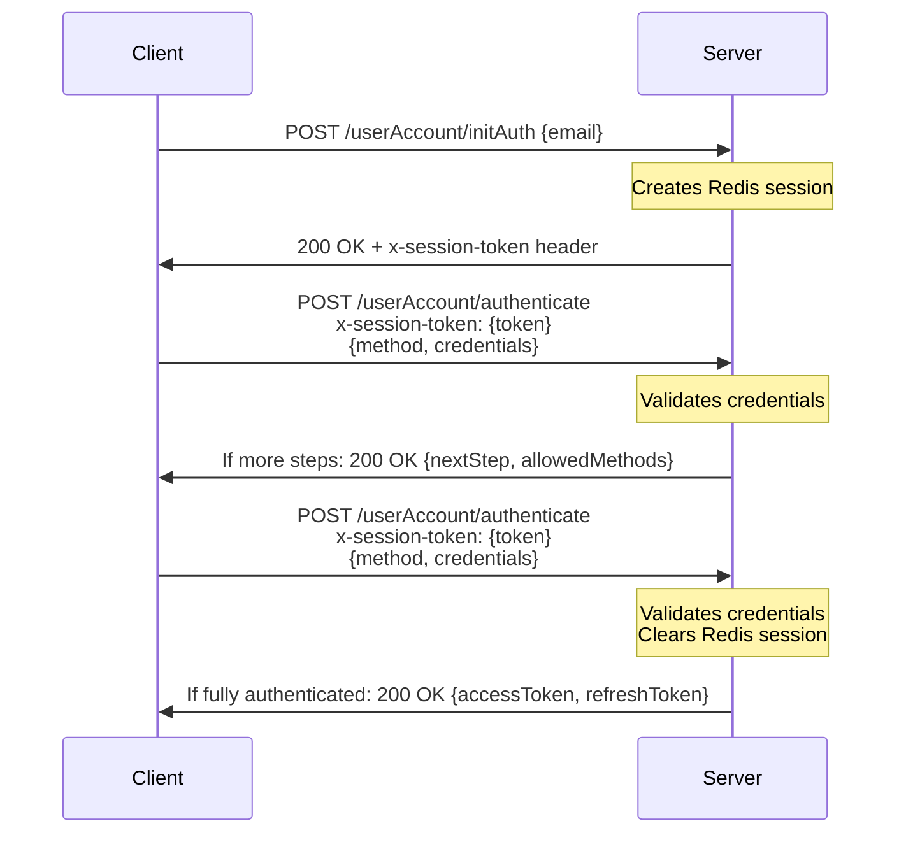

# Authentication Service

The Authentication Service provides secure user authentication and authorization capabilities across your organization's ecosystem. It manages user identity verification, session handling, and supports multiple authentication methods including password, one-time passwords (OTP), OAuth providers (Google, Microsoft), Azure AD, and SAML SSO.

## Architecture Overview

The Authentication Service is built on a Node.js backend with MongoDB for data persistence and Redis for session management. The service implements a container-based dependency injection pattern using InversifyJS for better modularity and testability.

Key components that the Auth Service integrates with:

- **IAM Service** - Manages user and organization information
- **Configuration Manager** - Stores authentication provider configurations
- **Communication Service** - Handles email delivery for password resets and OTP
- **Redis** - Manages authentication sessions and temporary tokens

## Authentication Flow Process

The Auth Service employs a multi-step session-based authentication flow:

1. **Authentication Initialization**
   - Client calls the `/userAccount/initAuth` endpoint with an email
   - Server validates the email and creates a temporary session in Redis
   - Server returns a session token in the `x-session-token` response header along with available authentication methods

2. **Authentication Steps**
   - Client calls `/userAccount/authenticate` with the session token in the `x-session-token` header
   - Client provides chosen authentication method and credentials
   - If multi-factor authentication is configured, the server returns information about the next step
   - Client repeats the authentication step with appropriate credentials until all required steps are completed

3. **Token Issuance**
   - After successful authentication, the server issues access and refresh tokens
   - The Redis session is cleared
   - Client stores tokens for subsequent API calls

Here's a sequence diagram of the flow:



## Data Models

<AccordionGroup>
  <Accordion title="OrgAuthConfig Schema">
  ```typescript
  interface IOrgAuthConfig extends Document {
    orgId: Types.ObjectId;
    domain?: string;
    authSteps: {
      order: number;
      allowedMethods: {
        type: 'samlSso' | 'otp' | 'password' | 'google' | 'microsoft' | 'azureAd';
      }[];
    }[];
    isDeleted?: boolean;
    createdAt?: Date;
    updatedAt?: Date;
  }
  ```
  </Accordion>

  <Accordion title="UserCredentials Schema">
  ```typescript
  interface IUserCredentials extends Document {
    userId?: string | null;
    orgId: string;
    ipAddress: string;
    otpValidity?: number;
    hashedOTP?: string;
    hashedPassword?: string;
    forceNewPasswordGeneration: boolean;
    wrongCredentialCount: number;
    isBlocked: boolean;
    isDeleted: boolean;
    createdAt?: Date;
    updatedAt?: Date;
  }
  ```
  </Accordion>

  <Accordion title="UserActivities Schema">
  ```typescript
  interface IUserActivity extends Document {
    email: string;
    userId: Types.ObjectId;
    orgId?: Types.ObjectId;
    activityType:
      | 'LOGIN'
      | 'LOGOUT'
      | 'LOGIN_ATTEMPT'
      | 'OTP_GENERATE'
      | 'WRONG_OTP'
      | 'WRONG_PASSWORD'
      | 'REFRESH_TOKEN';
    loginMode?:
      | 'OTP'
      | 'PASSWORD'
      | 'AUTH SERVICE'
      | 'GOOGLE OAUTH'
      | 'MICROSOFT OAUTH'
      | 'SSO';
    ipAddress: string;
    isDeleted?: boolean;
    createdAt?: Date;
    updatedAt?: Date;
  }
  ```
  </Accordion>

  <Accordion title="Session Data">
  ```typescript
  interface SessionData {
    token?: string;
    userId: string;
    email: string;
    orgId: string;
    authConfig: IAuthStep[];
    currentStep: number;
    isAuthenticated?: boolean;
    [key: string]: any; // Allows additional properties
  }
  ```
  </Accordion>
</AccordionGroup>

## Session Management with Redis

The Auth Service uses Redis to store temporary session data during the authentication process:

- **Sessions** are identified by a unique UUID token
- The **x-session-token** header is used to track the session across requests
- Sessions expire after a configurable period (default: 1 hour)
- Session data includes authentication state, user info, and available auth methods
- After successful authentication, sessions are deleted from Redis

## Token-Based Authentication

After successful authentication, the service issues two types of JWTs:

1. **Access Token**
   - Short-lived token (typically 1 hour)
   - Contains user ID, organization ID, user email, and permissions
   - Used for authorizing API requests across services

2. **Refresh Token**
   - Longer-lived token (typically 7 days)
   - Used to obtain new access tokens when they expire
   - Prevents the need for frequent re-authentication

Both tokens are cryptographically signed with JWT secrets to ensure authenticity.

## Auth Service API

### Authentication Endpoints

<CodeGroup>
  ```http title="Init Authentication"
  POST /api/v1/userAccount/initAuth
  ```

  **Request Body Parameters:**
  
  | Parameter | Type | Required | Description |
  |-----------|------|----------|-------------|
  | email | string | Yes | The user's email address |

  **Response Headers:**
  
  | Header | Description |
  |--------|-------------|
  | x-session-token | Session token to be used in subsequent authentication requests |

  ```json title="Init Auth Response"
  {
    "currentStep": 0,
    "allowedMethods": ["password", "otp", "google"],
    "message": "Authentication initialized",
    "authProviders": {
      "google": {
        "clientId": "your-google-client-id.apps.googleusercontent.com"
      }
    }
  }
  ```

  **Important Note:**
  The `x-session-token` is returned in the response headers, not in the response body. This token must be captured and passed in subsequent authenticate requests.
</CodeGroup>

### Authentication Process

<CodeGroup>
  ```http title="Authenticate"
  POST /api/v1/userAccount/authenticate
  ```
  
  **Headers:**
  
  | Header | Value | Required | Description |
  |--------|-------|----------|-------------|
  | x-session-token | string | Yes | Session token obtained from the initAuth response headers |

  **Request Body Parameters:**
  
  | Parameter | Type | Required | Description |
  |-----------|------|----------|-------------|
  | method | string | Yes | Authentication method (password, otp, google, microsoft, azureAd, samlSso) |
  | credentials | object | Yes | Credentials object for the specified method |

  **Credentials by Method:**
  
  **For password authentication:**
  ```json
  {
    "method": "password",
    "credentials": {
      "password": "your-secure-password"
    }
  }
  ```
  
  **For OTP authentication:**
  ```json
  {
    "method": "otp",
    "credentials": {
      "otp": "123456"
    }
  }
  ```
  
  **For Google authentication:**
  ```json
  {
    "method": "google",
    "credentials": "google-id-token-string"
  }
  ```
  
  **For Microsoft/Azure AD authentication:**
  ```json
  {
    "method": "microsoft",
    "credentials": {
      "accessToken": "microsoft-access-token",
      "idToken": "microsoft-id-token"
    }
  }
  ```

  ```json title="Multi-Step Auth Response"
  {
    "status": "success",
    "nextStep": 1,
    "allowedMethods": ["otp"],
    "authProviders": {}
  }
  ```

  ```json title="Complete Auth Response"
  {
    "message": "Fully authenticated",
    "accessToken": "eyJhbGciOiJIUzI1NiIsInR5cCI6IkpXVCJ9...",
    "refreshToken": "eyJhbGciOiJIUzI1NiIsInR5cCI6IkpXVCJ9..."
  }
  ```
</CodeGroup>

### OTP Authentication

<CodeGroup>
  ```http title="Generate OTP"
  POST /api/v1/userAccount/login/otp/generate
  ```

  **Request Body Parameters:**
  
  | Parameter | Type | Required | Description |
  |-----------|------|----------|-------------|
  | email | string | Yes | The user's email address |

  ```json title="OTP Generation Response"
  {
    "data": "OTP sent"
  }
  ```
</CodeGroup>

### Password Management

<CodeGroup>
  ```http title="Forgot Password"
  POST /api/v1/userAccount/password/forgot
  ```

  **Request Body Parameters:**
  
  | Parameter | Type | Required | Description |
  |-----------|------|----------|-------------|
  | email | string | Yes | The user's email address |

  ```json title="Forgot Password Response"
  {
    "data": "password reset mail sent"
  }
  ```
</CodeGroup>

<CodeGroup>
  ```http title="Reset Password with Token"
  POST /api/v1/userAccount/password/reset/token
  ```

  **Headers:**
  
  | Header | Value | Required | Description |
  |--------|-------|----------|-------------|
  | Authorization | Bearer {token} | Yes | Password reset token from email |

  **Request Body Parameters:**
  
  | Parameter | Type | Required | Description |
  |-----------|------|----------|-------------|
  | password | string | Yes | New password |

  ```json title="Token Reset Response"
  {
    "data": "password reset"
  }
  ```
</CodeGroup>

<CodeGroup>
  ```http title="Change Password"
  POST /api/v1/userAccount/password/reset
  ```

  **Headers:**
  
  | Header | Value | Required | Description |
  |--------|-------|----------|-------------|
  | Authorization | Bearer {token} | Yes | Valid access token |

  **Request Body Parameters:**
  
  | Parameter | Type | Required | Description |
  |-----------|------|----------|-------------|
  | currentPassword | string | Yes | Current password |
  | newPassword | string | Yes | New password |

  ```json title="Password Change Response"
  {
    "data": "password reset"
  }
  ```
</CodeGroup>

### Token Management

<CodeGroup>
  ```http title="Refresh Token"
  POST /api/v1/userAccount/refresh/token
  ```

  **Headers:**
  
  | Header | Value | Required | Description |
  |--------|-------|----------|-------------|
  | Authorization | Bearer {refresh_token} | Yes | Valid refresh token |

  **Request Body Parameters:**
  No body parameters required.

  ```json title="Token Refresh Response"
  {
    "user": {
      "_id": "60d21b4667d0d8992e610c85",
      "email": "user@example.com",
      "fullName": "John Doe",
      "orgId": "60a2b5e3a1b3c4d5e6f7g8h9"
    },
    "accessToken": "eyJhbGciOiJIUzI1NiIsInR5cCI6IkpXVCJ9..."
  }
  ```
</CodeGroup>

<CodeGroup>
  ```http title="Logout"
  POST /api/v1/userAccount/logout/manual
  ```

  **Headers:**
  
  | Header | Value | Required | Description |
  |--------|-------|----------|-------------|
  | Authorization | Bearer {token} | Yes | Valid access token |

  **Request Body Parameters:**
  No body parameters required.

  ```json title="Logout Response"
  200 OK
  ```
</CodeGroup>

### SAML SSO Integration

<CodeGroup>
  ```http title="SAML Sign-In"
  GET /api/v1/saml/signIn
  ```
  
  **Query Parameters:**
  
  | Parameter | Type | Required | Description |
  |-----------|------|----------|-------------|
  | email | string | Yes | The user's email address |
  | sessionToken | string | Yes | Session token from init authentication |

  ```json title="SAML Sign-In"
  // Redirects to Identity Provider login page
  ```
</CodeGroup>

<CodeGroup>
  ```http title="SAML Callback"
  POST /api/v1/saml/signIn/callback
  ```
  
  This endpoint is called by the Identity Provider after successful authentication.
  No manual parameters needed as this is part of the SAML flow.
  
  ```json title="SAML Callback Response"
  // Redirects to `/auth/sign-in/samlSso/success` with authentication cookies.
  200 OK
  ```
</CodeGroup>

### Organization Auth Configuration

<CodeGroup>
  ```http title="Get Auth Methods"
  GET /api/v1/orgAuthConfig/authMethods
  ```

  **Headers:**
  
  | Header | Value | Required | Description |
  |--------|-------|----------|-------------|
  | Authorization | Bearer {token} | Yes | Valid admin access token |

  ```json title="Auth Methods Response"
  {
    "authMethods": [
      {
        "order": 1,
        "allowedMethods": [
          {
            "type": "password"
          },
          {
            "type": "otp"
          }
        ]
      },
      {
        "order": 2,
        "allowedMethods": [
          {
            "type": "google"
          }
        ]
      }
    ]
  }
  ```
</CodeGroup>

<CodeGroup>
  ```http title="Update Auth Methods"
  POST /api/v1/orgAuthConfig/updateAuthMethod
  ```

  **Headers:**
  
  | Header | Value | Required | Description |
  |--------|-------|----------|-------------|
  | Authorization | Bearer {token} | Yes | Valid admin access token |

  **Request Body Parameters:**
  
  | Parameter | Type | Required | Description |
  |-----------|------|----------|-------------|
  | authMethod | array | Yes | Array of authentication steps |

  **Auth Method Structure:**
  ```json
  {
    "authMethod": [
      {
        "order": 1,
        "allowedMethods": [
          {
            "type": "password"
          },
          {
            "type": "otp"
          }
        ]
      },
      {
        "order": 2,
        "allowedMethods": [
          {
            "type": "google"
          }
        ]
      }
    ]
  }
  ```

  ```json title="Auth Method Update Response"
  {
    "message": "Auth method updated",
    "authMethod": [
      {
        "order": 1,
        "allowedMethods": [
          {
            "type": "password"
          },
          {
            "type": "google"
          }
        ]
      },
      {
        "order": 2,
        "allowedMethods": [
          {
            "type": "otp"
          }
        ]
      }
    ]
  }
  ```
</CodeGroup>

<CodeGroup>
  ```http title="Setup Org Auth Config"
  POST /api/v1/orgAuthConfig/
  ```

  **Headers:**
  
  | Header | Value | Required | Description |
  |--------|-------|----------|-------------|
  | Authorization | Bearer {token} | Yes | Valid admin access token |

  **Request Body Parameters:**
  
  | Parameter | Type | Required | Description |
  |-----------|------|----------|-------------|
  | contactEmail | string | Yes | Organization contact email |
  | registeredName | string | Yes | Organization registered name |
  | adminFullName | string | Yes | Admin's full name |
  | sendEmail | boolean | No | Whether to send email notifications (default: false) |

  ```json title="Org Config Setup Response"
  {
    "message": "Org Auth Config created successfully"
  }
  ```
</CodeGroup>

## Security Considerations

The Authentication Service implements several security measures:

- **Password Security**
  - Passwords are validated for complexity requirements
  - Passwords are hashed using bcrypt with salt rounds
  - Password reset links have limited validity

- **Brute Force Protection**
  - Failed login attempts are tracked
  - Accounts are automatically blocked after multiple failures
  - Suspicious login attempts trigger notification emails

- **Session Security**
  - Session tokens are generated as UUIDs
  - Sessions have limited lifetime and are stored in Redis
  - Sessions are invalidated after authentication or timeout

- **JWT Security**
  - Tokens are signed with secure secrets
  - Different scopes are used for different token types
  - Access tokens have short lifetimes