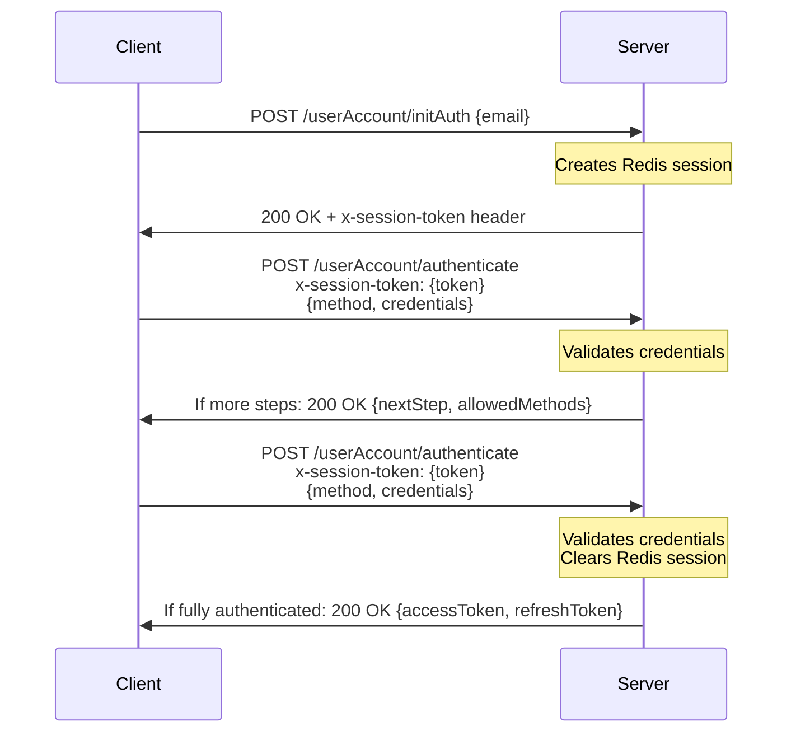

# Authentication Service

The Authentication Service provides secure user authentication and authorization capabilities across your organization's ecosystem. It manages user identity verification, session handling, and supports multiple authentication methods including password, one-time passwords (OTP), OAuth providers (Google, Microsoft), Azure AD, OAuth, and SAML SSO.

## Base URL

All endpoints are prefixed with `/api/v1`

## Authentication

Most endpoints require authentication via Bearer token:

```http
Authorization: Bearer YOUR_TOKEN
```

**Internal endpoints** use scoped token authentication for service-to-service communication with specific scopes:
- `PASSWORD_RESET` - For password reset operations
- `TOKEN_REFRESH` - For token refresh operations
- `FETCH_CONFIG` - For configuration updates

## Architecture Overview

The Authentication Service is built on a Node.js backend with MongoDB for data persistence and Redis for session management. The service implements a container-based dependency injection pattern using InversifyJS for better modularity and testability.

Key components that the Auth Service integrates with:

- **IAM Service** - Manages user and organization information
- **Configuration Manager** - Stores authentication provider configurations
- **Communication Service** - Handles email delivery for password resets and OTP
- **Redis** - Manages authentication sessions and temporary tokens

## Authentication Flow Process

The Auth Service employs a multi-step session-based authentication flow:

1. **Authentication Initialization**
   - Client calls the `/userAccount/initAuth` endpoint with an email
   - Server validates the email and creates a temporary session in Redis
   - Server returns a session token in the `x-session-token` response header along with available authentication methods

2. **Authentication Steps**
   - Client calls `/userAccount/authenticate` with the session token in the `x-session-token` header
   - Client provides chosen authentication method and credentials
   - If multi-factor authentication is configured, the server returns information about the next step
   - Client repeats the authentication step with appropriate credentials until all required steps are completed

3. **Token Issuance**
   - After successful authentication, the server issues access and refresh tokens
   - The Redis session is cleared
   - Client stores tokens for subsequent API calls

Here's a sequence diagram of the flow:



## Data Models

<AccordionGroup>
  <Accordion title="OrgAuthConfig Schema">
  ```typescript
  interface IOrgAuthConfig extends Document {
    orgId: Types.ObjectId;
    domain?: string;
    authSteps: {
      order: number;
      allowedMethods: {
        type: 'samlSso' | 'otp' | 'password' | 'google' | 'microsoft' | 'azureAd' | 'oauth';
      }[];
    }[];
    isDeleted?: boolean;
    createdAt?: Date;
    updatedAt?: Date;
  }
  ```
  </Accordion>

  <Accordion title="UserCredentials Schema">
  ```typescript
  interface IUserCredentials extends Document {
    userId?: string | null;
    orgId: string;
    ipAddress: string;
    otpValidity?: number;
    hashedOTP?: string;
    hashedPassword?: string;
    forceNewPasswordGeneration: boolean;
    wrongCredentialCount: number;
    isBlocked: boolean;
    isDeleted: boolean;
    createdAt?: Date;
    updatedAt?: Date;
  }
  ```
  </Accordion>

  <Accordion title="UserActivities Schema">
  ```typescript
  interface IUserActivity extends Document {
    email: string;
    userId: Types.ObjectId;
    orgId?: Types.ObjectId;
    activityType:
      | 'LOGIN'
      | 'LOGOUT'
      | 'LOGIN_ATTEMPT'
      | 'OTP_GENERATE'
      | 'WRONG_OTP'
      | 'WRONG_PASSWORD'
      | 'REFRESH_TOKEN';
    loginMode?:
      | 'OTP'
      | 'PASSWORD'
      | 'AUTH SERVICE'
      | 'GOOGLE OAUTH'
      | 'MICROSOFT OAUTH'
      | 'AZUREAD OAUTH'
      | 'OAUTH'
      | 'SSO';
    ipAddress: string;
    isDeleted?: boolean;
    createdAt?: Date;
    updatedAt?: Date;
  }
  ```
  </Accordion>

  <Accordion title="Session Data">
  ```typescript
  interface SessionData {
    token?: string;
    userId: string;
    email: string;
    orgId: string;
    authConfig: IAuthStep[];
    currentStep: number;
    isAuthenticated?: boolean;
    [key: string]: any; // Allows additional properties
  }
  ```
  </Accordion>
</AccordionGroup>

## Session Management with Redis

The Auth Service uses Redis to store temporary session data during the authentication process:

- **Sessions** are identified by a unique UUID token
- The **x-session-token** header is used to track the session across requests
- Sessions expire after a configurable period (default: 1 hour)
- Session data includes authentication state, user info, and available auth methods
- After successful authentication, sessions are deleted from Redis

## Token-Based Authentication

After successful authentication, the service issues two types of JWTs:

1. **Access Token**
   - Short-lived token (typically 1 hour)
   - Contains user ID, organization ID, user email, and permissions
   - Used for authorizing API requests across services

2. **Refresh Token**
   - Longer-lived token (typically 7 days)
   - Used to obtain new access tokens when they expire
   - Prevents the need for frequent re-authentication

Both tokens are cryptographically signed with JWT secrets to ensure authenticity.

## API Endpoints

<AccordionGroup>

<Accordion title="Authentication Flow">
Core authentication endpoints for initializing and completing the authentication process.

<AccordionGroup>

<Accordion title="POST /userAccount/initAuth - Initialize Authentication">
Start the authentication process for a user.

<Tabs>
<Tab title="Request">
**Endpoint:** `POST /api/v1/userAccount/initAuth`

**Request Body Parameters:**
  
| Parameter | Type | Required | Description |
|-----------|------|----------|-------------|
| email | string | Yes | The user's email address |

```json
{
  "email": "user@example.com"
}
```
</Tab>

<Tab title="Response">
**Status:** `200 OK`

**Response Headers:**
  
| Header | Description |
|--------|-------------|
| x-session-token | Session token to be used in subsequent authentication requests |

```json
{
  "currentStep": 0,
  "allowedMethods": ["password", "otp", "google"],
  "message": "Authentication initialized",
  "authProviders": {
    "google": {
      "clientId": "your-google-client-id.apps.googleusercontent.com"
    }
  }
}
```

**Important Note:**
The `x-session-token` is returned in the response headers, not in the response body. This token must be captured and passed in subsequent authenticate requests.
</Tab>
</Tabs>
</Accordion>

<Accordion title="POST /userAccount/authenticate - Authenticate User">
Perform authentication with credentials for a specific method.

<Tabs>
<Tab title="Request">
**Endpoint:** `POST /api/v1/userAccount/authenticate`
  
**Headers:**
  
| Header | Value | Required | Description |
|--------|-------|----------|-------------|
| x-session-token | string | Yes | Session token obtained from the initAuth response headers |

**Request Body Parameters:**
  
| Parameter | Type | Required | Description |
|-----------|------|----------|-------------|
| method | string | Yes | Authentication method (password, otp, google, microsoft, azureAd, oauth, samlSso) |
| credentials | object | Yes | Credentials object for the specified method |

**Authentication Methods:**

```json title="Password Authentication"
{
  "method": "password",
  "credentials": {
    "password": "your-secure-password"
  }
}
```
  
```json title="OTP Authentication"
{
  "method": "otp",
  "credentials": {
    "otp": "123456"
  }
}
```
  
```json title="Google Authentication"
{
  "method": "google",
  "credentials": "google-id-token-string"
}
```
  
```json title="Microsoft Authentication"
{
  "method": "microsoft",
  "credentials": {
    "accessToken": "microsoft-access-token",
    "idToken": "microsoft-id-token"
  }
}
```

```json title="Azure AD Authentication"
{
  "method": "azureAd",
  "credentials": {
    "accessToken": "azure-ad-access-token",
    "idToken": "azure-ad-id-token"
  }
}
```

```json title="OAuth Authentication"
{
  "method": "oauth",
  "credentials": {
    "accessToken": "oauth-access-token",
    "idToken": "oauth-id-token"
  }
}
```
</Tab>

<Tab title="Response">
**Multi-Step Authentication Response:**

```json
{
  "status": "success",
  "nextStep": 1,
  "allowedMethods": ["otp"],
  "authProviders": {}
}
```

**Complete Authentication Response:**

```json
{
  "message": "Fully authenticated",
  "accessToken": "eyJhbGciOiJIUzI1NiIsInR5cCI6IkpXVCJ9...",
  "refreshToken": "eyJhbGciOiJIUzI1NiIsInR5cCI6IkpXVCJ9..."
}
```
</Tab>
</Tabs>
</Accordion>

</AccordionGroup>
</Accordion>

<Accordion title="OTP Authentication">
One-time password generation and validation.

<AccordionGroup>

<Accordion title="POST /userAccount/login/otp/generate - Generate OTP">
Generate and send an OTP to the user's email.

<Tabs>
<Tab title="Request">
**Endpoint:** `POST /api/v1/userAccount/login/otp/generate`

**Request Body Parameters:**
  
| Parameter | Type | Required | Description |
|-----------|------|----------|-------------|
| email | string | Yes | The user's email address (must be valid email format) |

**Validation:**
- Email must be in valid email format
- Request goes through ValidationMiddleware with email validation

```json
{
  "email": "user@example.com"
}
```
</Tab>

<Tab title="Response">
**Status:** `200 OK`

```json
{
  "data": "OTP sent"
}
```
  
**Note:** The actual response data may vary based on the result from the service layer.
</Tab>
</Tabs>
</Accordion>

</AccordionGroup>
</Accordion>

<Accordion title="OAuth Integration">
OAuth token exchange and provider integration.

<AccordionGroup>

<Accordion title="POST /userAccount/oauth/exchange - Exchange OAuth Token">
Exchange OAuth authorization code for tokens.

<Tabs>
<Tab title="Request">
**Endpoint:** `POST /api/v1/userAccount/oauth/exchange`

**Request Body Parameters:**
  
| Parameter | Type | Required | Description |
|-----------|------|----------|-------------|
| code | string | Yes | Authorization code from OAuth provider |
| email | string | Yes | User's email address |
| provider | string | Yes | OAuth provider name |
| redirectUri | string | Yes | Redirect URI used in OAuth flow |

```json
{
  "code": "authorization-code-from-provider",
  "email": "user@example.com",
  "provider": "google",
  "redirectUri": "https://your-app.com/callback"
}
```
</Tab>

<Tab title="Response">
**Status:** `200 OK`

```json
{
  "access_token": "oauth-access-token",
  "id_token": "oauth-id-token",
  "token_type": "Bearer",
  "expires_in": 3600
}
```
</Tab>
</Tabs>
</Accordion>

</AccordionGroup>
</Accordion>

<Accordion title="Password Management">
Password reset, change, and recovery operations.

<AccordionGroup>

<Accordion title="POST /userAccount/password/forgot - Forgot Password">
Initiate password reset process via email.

<Tabs>
<Tab title="Request">
**Endpoint:** `POST /api/v1/userAccount/password/forgot`

**Request Body Parameters:**
  
| Parameter | Type | Required | Description |
|-----------|------|----------|-------------|
| email | string | Yes | The user's email address |

```json
{
  "email": "user@example.com"
}
```
</Tab>

<Tab title="Response">
**Status:** `200 OK`

```json
{
  "data": "password reset mail sent"
}
```
</Tab>
</Tabs>
</Accordion>

<Accordion title="POST /userAccount/password/reset/token - Reset Password with Token">
Reset password using token from email.

<Tabs>
<Tab title="Request">
**Endpoint:** `POST /api/v1/userAccount/password/reset/token`

**Headers:**
  
| Header | Value | Required | Description |
|--------|-------|----------|-------------|
| Authorization | Bearer {token} | Yes | Password reset token from email (uses PASSWORD_RESET scope) |

**Request Body Parameters:**
  
| Parameter | Type | Required | Description |
|-----------|------|----------|-------------|
| password | string | Yes | New password (must meet complexity requirements) |

```json
{
  "password": "new-secure-password"
}
```
</Tab>

<Tab title="Response">
**Status:** `200 OK`

```json
{
  "data": "password reset"
}
```
</Tab>
</Tabs>
</Accordion>

<Accordion title="POST /userAccount/password/reset - Change Password">
Change password for authenticated user.

<Tabs>
<Tab title="Request">
**Endpoint:** `POST /api/v1/userAccount/password/reset`

**Headers:**
  
| Header | Value | Required | Description |
|--------|-------|----------|-------------|
| Authorization | Bearer {token} | Yes | Valid access token (requires user authentication) |

**Request Body Parameters:**
  
| Parameter | Type | Required | Description |
|-----------|------|----------|-------------|
| currentPassword | string | Yes | Current password |
| newPassword | string | Yes | New password (must meet complexity requirements) |

```json
{
  "currentPassword": "current-password",
  "newPassword": "new-secure-password"
}
```
</Tab>

<Tab title="Response">
**Status:** `200 OK`

```json
{
  "data": "password reset"
}
```
</Tab>
</Tabs>
</Accordion>

</AccordionGroup>
</Accordion>

<Accordion title="Token Management">
Token refresh and session management operations.

<AccordionGroup>

<Accordion title="POST /userAccount/refresh/token - Refresh Token">
Refresh access token using refresh token.

<Tabs>
<Tab title="Request">
**Endpoint:** `POST /api/v1/userAccount/refresh/token`

**Headers:**
  
| Header | Value | Required | Description |
|--------|-------|----------|-------------|
| Authorization | Bearer {refresh_token} | Yes | Valid refresh token (uses TOKEN_REFRESH scope) |

**Request Body Parameters:**
No body parameters required.
</Tab>

<Tab title="Response">
**Status:** `200 OK`

```json
{
  "user": {
    "_id": "60d21b4667d0d8992e610c85",
    "email": "user@example.com",
    "fullName": "John Doe",
    "orgId": "60a2b5e3a1b3c4d5e6f7g8h9"
  },
  "accessToken": "eyJhbGciOiJIUzI1NiIsInR5cCI6IkpXVCJ9..."
}
```
</Tab>
</Tabs>
</Accordion>

<Accordion title="POST /userAccount/logout/manual - Logout">
Logout user and invalidate session.

<Tabs>
<Tab title="Request">
**Endpoint:** `POST /api/v1/userAccount/logout/manual`

**Headers:**
  
| Header | Value | Required | Description |
|--------|-------|----------|-------------|
| Authorization | Bearer {token} | Yes | Valid access token (requires user authentication) |

**Request Body Parameters:**
No body parameters required.
</Tab>

<Tab title="Response">
**Status:** `200 OK`
  
**Note:** This endpoint returns an empty response body (status 200 only).
</Tab>
</Tabs>
</Accordion>

</AccordionGroup>
</Accordion>

<Accordion title="SAML SSO Integration">
SAML Single Sign-On authentication and configuration.

<AccordionGroup>

<Accordion title="GET /saml/signIn - SAML Sign-In">
Initiate SAML authentication flow.

<Tabs>
<Tab title="Request">
**Endpoint:** `GET /api/v1/saml/signIn`
  
**Query Parameters:**
  
| Parameter | Type | Required | Description |
|-----------|------|----------|-------------|
| email | string | Yes | The user's email address |
| sessionToken | string | Yes | Session token from init authentication |

```http
GET /api/v1/saml/signIn?email=user@example.com&sessionToken=session-token-123
```
</Tab>

<Tab title="Response">
**Response:** Redirects to Identity Provider login page
</Tab>
</Tabs>
</Accordion>

<Accordion title="POST /saml/signIn/callback - SAML Callback">
Handle SAML authentication response from Identity Provider.

<Tabs>
<Tab title="Request">
**Endpoint:** `POST /api/v1/saml/signIn/callback`
  
This endpoint is called by the Identity Provider after successful authentication.
No manual parameters needed as this is part of the SAML flow.
</Tab>

<Tab title="Response">
**Status:** `200 OK`

Redirects to `/auth/sign-in/samlSso/success` with authentication cookies.
</Tab>
</Tabs>
</Accordion>

<Accordion title="POST /saml/updateAppConfig - Update SAML App Config">
Update SAML application configuration.

<Tabs>
<Tab title="Request">
**Endpoint:** `POST /api/v1/saml/updateAppConfig`

**Headers:**
  
| Header | Value | Required | Description |
|--------|-------|----------|-------------|
| Authorization | Bearer {token} | Yes | Valid scoped token with FETCH_CONFIG scope |
</Tab>

<Tab title="Response">
**Status:** `200 OK`

```json
{
  "message": "Auth configuration updated successfully",
  "config": {
    // Updated configuration object
  }
}
```
</Tab>
</Tabs>
</Accordion>

</AccordionGroup>
</Accordion>

<Accordion title="Organization Auth Configuration">
Manage organization-wide authentication settings and methods.

<AccordionGroup>

<Accordion title="GET /orgAuthConfig/authMethods - Get Auth Methods">
Retrieve current authentication methods configuration.

<Tabs>
<Tab title="Request">
**Endpoint:** `GET /api/v1/orgAuthConfig/authMethods`

**Headers:**
  
| Header | Value | Required | Description |
|--------|-------|----------|-------------|
| Authorization | Bearer {token} | Yes | Valid admin access token |
</Tab>

<Tab title="Response">
**Status:** `200 OK`

```json
{
  "authMethods": [
    {
      "order": 1,
      "allowedMethods": [
        {
          "type": "password"
        },
        {
          "type": "otp"
        }
      ]
    },
    {
      "order": 2,
      "allowedMethods": [
        {
          "type": "google"
        }
      ]
    }
  ]
}
```
</Tab>
</Tabs>
</Accordion>

<Accordion title="POST /orgAuthConfig/updateAuthMethod - Update Auth Methods">
Update organization authentication methods configuration.

<Tabs>
<Tab title="Request">
**Endpoint:** `POST /api/v1/orgAuthConfig/updateAuthMethod`

**Headers:**
  
| Header | Value | Required | Description |
|--------|-------|----------|-------------|
| Authorization | Bearer {token} | Yes | Valid admin access token |

**Request Body Parameters:**
  
| Parameter | Type | Required | Description |
|-----------|------|----------|-------------|
| authMethod | array | Yes | Array of authentication steps |

**Auth Method Structure:**
```json
{
  "authMethod": [
    {
      "order": 1,
      "allowedMethods": [
        {
          "type": "password"
        },
        {
          "type": "otp"
        }
      ]
    },
    {
      "order": 2,
      "allowedMethods": [
        {
          "type": "google"
        }
      ]
    }
  ]
}
```

**Validation Rules:**
- Must have between 1 and 3 authentication steps
- Each step must have a unique order number
- At least one authentication method is required per step
- No duplicate authentication methods within the same step
- No duplicate authentication methods across different steps
- Each authentication method can only be used once in the entire configuration

**Supported Authentication Types:**
- `password` - Username/password authentication
- `otp` - One-time password via email
- `google` - Google OAuth authentication
- `microsoft` - Microsoft OAuth authentication
- `azureAd` - Azure Active Directory authentication
- `oauth` - Generic OAuth authentication
- `samlSso` - SAML Single Sign-On
</Tab>

<Tab title="Response">
**Status:** `200 OK`

```json
{
  "message": "Auth method updated",
  "authMethod": [
    {
      "order": 1,
      "allowedMethods": [
        {
          "type": "password"
        },
        {
          "type": "google"
        }
      ]
    },
    {
      "order": 2,
      "allowedMethods": [
        {
          "type": "otp"
        }
      ]
    }
  ]
}
```
</Tab>
</Tabs>
</Accordion>

<Accordion title="POST /orgAuthConfig/ - Setup Org Auth Config">
Initialize organization authentication configuration.

<Tabs>
<Tab title="Request">
**Endpoint:** `POST /api/v1/orgAuthConfig/`

**Headers:**
  
| Header | Value | Required | Description |
|--------|-------|----------|-------------|
| Authorization | Bearer {token} | Yes | Valid admin access token |

**Request Body Parameters:**
  
| Parameter | Type | Required | Description |
|-----------|------|----------|-------------|
| contactEmail | string | Yes | Organization contact email |
| registeredName | string | Yes | Organization registered name |
| adminFullName | string | Yes | Admin's full name |
| sendEmail | boolean | No | Whether to send email notifications (default: false) |

```json
{
  "contactEmail": "admin@example.com",
  "registeredName": "Example Corporation",
  "adminFullName": "John Admin",
  "sendEmail": false
}
```
</Tab>

<Tab title="Response">
**Status:** `200 OK`

```json
{
  "message": "Org Auth Config created successfully"
}
```
</Tab>
</Tabs>
</Accordion>

</AccordionGroup>
</Accordion>

<Accordion title="Internal Endpoints">
Internal service-to-service endpoints for configuration and validation.

<AccordionGroup>

<Accordion title="GET /userAccount/internal/password/check - Check Password Method">
Check if password authentication is enabled for the organization.

<Tabs>
<Tab title="Request">
**Endpoint:** `GET /api/v1/userAccount/internal/password/check`

**Headers:**
  
| Header | Value | Required | Description |
|--------|-------|----------|-------------|
| Authorization | Bearer {token} | Yes | Valid scoped token with FETCH_CONFIG scope |
</Tab>

<Tab title="Response">
**Status:** `200 OK`

```json
{
  "isPasswordAuthEnabled": true
}
```
</Tab>
</Tabs>
</Accordion>

</AccordionGroup>
</Accordion>

</AccordionGroup>

## Security Considerations

The Authentication Service implements several security measures:

### Password Security
- Passwords are validated for complexity requirements (minimum 8 characters with at least one uppercase, one lowercase, one number, and one special character)
- Passwords are hashed using bcrypt with salt rounds
- Password reset links have limited validity

### Brute Force Protection
- Failed login attempts are tracked per user account
- Accounts are automatically blocked after 5 consecutive failed attempts
- Suspicious login attempts trigger notification emails
- Blocked accounts require admin intervention to restore access

### Session Security
- Session tokens are generated as UUIDs
- Sessions have limited lifetime (default: 1 hour) and are stored in Redis
- Sessions are invalidated after successful authentication or timeout
- Session data is encrypted and contains minimal user information

### JWT Security
- Tokens are signed with secure secrets
- Different scopes are used for different token types (auth, refresh, password reset, etc.)
- Access tokens have short lifetimes (typically 1 hour)
- Refresh tokens have longer lifetimes (typically 7 days)

### OAuth Security
- OAuth tokens are validated against provider endpoints
- Email verification ensures token authenticity
- Provider-specific validation for Google, Microsoft, and Azure AD
- Generic OAuth support with configurable endpoints

### SAML Security
- SAML responses are cryptographically verified
- Certificate-based validation
- Configurable email field mapping
- Relay state protection against CSRF attacks

## Error Handling

All endpoints return structured error responses:

```json
{
  "error": {
    "code": "AUTHENTICATION_FAILED",
    "message": "Invalid credentials provided",
    "details": {
      "field": "password",
      "issue": "Password does not match"
    }
  }
}
```

**Common Error Codes:**
- `AUTHENTICATION_FAILED` - Invalid credentials
- `SESSION_EXPIRED` - Session token expired
- `INVALID_TOKEN` - Invalid or malformed token
- `USER_BLOCKED` - Account is blocked due to failed attempts
- `VALIDATION_ERROR` - Invalid request parameters
- `UNAUTHORIZED` - Missing or invalid authentication
- `FORBIDDEN` - Insufficient permissions
- `NOT_FOUND` - Resource not found
- `INTERNAL_ERROR` - Server error

## Important Notes

1. **Session Token Management:** The `x-session-token` header is critical for multi-step authentication flows
2. **Password Complexity:** Passwords must meet minimum security requirements
3. **Account Blocking:** Users are automatically blocked after 5 failed login attempts
4. **Token Scopes:** Different endpoints require different token scopes for access
5. **Multi-Factor Authentication:** Organizations can configure multiple authentication steps
6. **Provider Configuration:** OAuth and SAML providers require proper configuration
7. **Email Validation:** All email fields are validated for proper format
8. **Security Headers:** Proper headers must be included for authentication flows